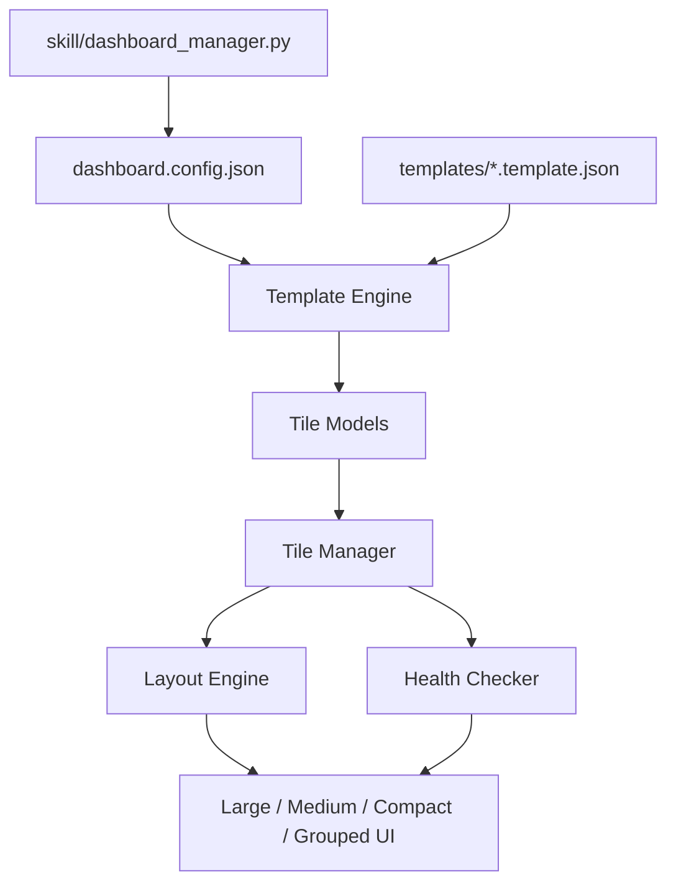

# OpenClaw Dashboard

Runtime-template integration dashboard for OpenClaw environments.

[](https://github.com/wspotter/openclaw-dashboard/actions/workflows/ci.yml)
[](LICENSE)
[](https://nodejs.org/)

## What It Does

- Renders integration tiles from runtime JSON templates (`templates/*.template.json`)
- Adapts layout density automatically as tile count grows
- Polls health and metrics with hard 5-second request timeouts
- Supports tile actions and detail panels for compact mode
- Lets OpenClaw manage tiles via CLI skill wrappers

## Adaptive Layout Model

- `1-4` tiles: large cards
- `5-9` tiles: medium cards
- `10-20` tiles: compact cards + detail panel
- `20+` tiles: category-grouped view (collapsed by default)

## Architecture



## Quick Start

```bash
git clone https://github.com/wspotter/openclaw-dashboard.git
cd openclaw-dashboard
npm install
npm run dev
```

Dashboard URL: `http://localhost:5173`

Build check:

```bash
npm run check
```

## OpenClaw Integration (Recommended)

Install the skill link so OpenClaw can operate the dashboard directly:

```bash
npm run install:openclaw-skill
```

This links:

`~/.openclaw/skills/openclaw-dashboard -> <repo>/skill`

After install, OpenClaw can use:

```bash
~/.openclaw/skills/openclaw-dashboard/dashboardctl list
~/.openclaw/skills/openclaw-dashboard/dashboardctl templates
~/.openclaw/skills/openclaw-dashboard/dashboardctl add --template comfyui --id comfyui-lab --name "ComfyUI Lab"
~/.openclaw/skills/openclaw-dashboard/dashboardctl set --id comfyui-lab --set host=localhost --set port=8188
~/.openclaw/skills/openclaw-dashboard/dashboardctl status
```

Start dashboard through skill wrapper:

```bash
~/.openclaw/skills/openclaw-dashboard/dashboardapp
```

Run diagnostics:

```bash
~/.openclaw/skills/openclaw-dashboard/dashboarddoctor
```

Full guide: [`OPENCLAW_INTEGRATION.md`](OPENCLAW_INTEGRATION.md)

## Template Workflow

1. Add or scaffold a template in `templates/`
2. Add an instance in `config/dashboard.config.json` (or use `dashboardctl add`)
3. Use `dashboardctl refresh --sync-missing` if needed
4. Click dashboard `Refresh` or wait for auto-reload polling

## Configuration

Copy `.env.example` if you need custom proxy host allowlist:

```bash
cp .env.example .env
```

`OPENCLAW_PROXY_ALLOWLIST` controls allowed hosts for `/api/proxy`.
Default: `localhost,127.0.0.1,::1`

## Repository Layout

- `src/core/` runtime orchestration
- `src/components/` tile/panel renderers
- `src/utils/` fetch timeout + jq-lite helpers
- `src/styles/` design and layout CSS
- `templates/` runtime template definitions
- `config/` tile instance config
- `skill/` OpenClaw skill wrappers and manager CLI
- `scripts/` install helpers

## Security Notes

- Do not commit credentials into template/config JSON files.
- Restrict proxy targets using `OPENCLAW_PROXY_ALLOWLIST`.
- Use an authenticated reverse proxy for internet-facing deployments.

## Contributing

See [`CONTRIBUTING.md`](CONTRIBUTING.md) and [`SECURITY.md`](SECURITY.md).

## License

MIT. See [`LICENSE`](LICENSE).
