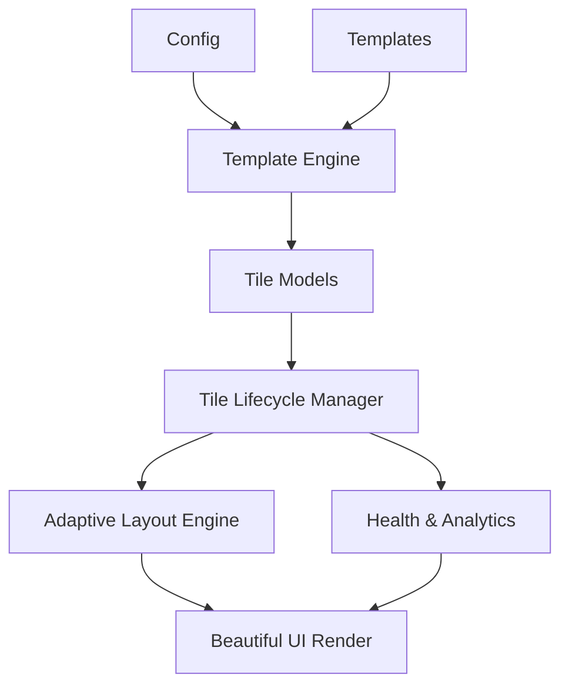

<div align="center">
  <h1>🦁 OpenClaw Dashboard</h1>
  <p><strong>A beautifully modular, adaptive command center for your OpenClaw ecosystem.</strong></p>
  
  [](https://github.com/wspotter/openclaw-dashboard/actions/workflows/ci.yml)
  [](LICENSE)
  [](https://nodejs.org/)
</div>

---

## ✨ Overview

Welcome to the **OpenClaw Dashboard**! This isn't just another static status page. It is a fully scalable, exceptionally designed integration hub built to give you a god's-eye view of your entire OpenClaw AI environment. 

Whether you're running 3 services or 30, the OpenClaw Dashboard gracefully adapts to your workflow, transforming raw metrics into an intuitive, visually stunning experience utilizing modern glassmorphism and deep dark-mode aesthetics.

## 🚀 Why You'll Love It

- **Dynamic Density Scaling**: The interface elegantly transitions from rich, expansive feature cards to a sleek, compact list as you add more integrations, without ever feeling cluttered.
- **Lightning Fast & Frictionless**: Built on pure Vanilla JavaScript and CSS via Vite. No heavy frameworks. No bloated dependencies. Just raw, uncompromising performance.
- **Zero-Touch Integration Engine**: Adding a new service is a breeze. Simply drop a JSON template into the `templates/` directory, and the dashboard seamlessly auto-discovers and integrates it—no frontend code changes required.
- **Built for Security**: Designed with an offline-first, LAN-native architecture ensuring your operational data stays strictly on your network.

---

## 🏗 System Architecture

The dashboard acts as the visual frontend to your backend integrations, powered by an intelligent runtime layout engine.



---

## ⚡ Getting Started

### 1. Installation
Clone the repository and install the lightning-fast dependencies.

```bash
git clone https://github.com/wspotter/openclaw-dashboard.git
cd openclaw-dashboard
npm install
```

### 2. Boot Up (Development)
Launch the development server and experience it live.

```bash
npm run dev
```
Navigate to `http://localhost:5173`. Prepare to be amazed.

### 3. Production Build
Ready for the big leagues? Compile an ultra-optimized static bundle.

```bash
npm run build
npm run preview
```

---

## 🧩 The Template Ecosystem

The real magic happens in the `templates/` directory. By dropping a perfectly crafted `.template.json` file, you can instantly teach the dashboard how to monitor and interact with a completely net-new service.

We've got you covered with 5 gorgeous starter templates out-of-the-box:
- 🎨 **ComfyUI** (Creative Generation)
- 📬 **Mailcow** (Communications)
- 🧠 **OpenClaw Gateway** (AI Core)
- 📦 **Delivery Hub** (Operations)
- 🎙️ **Voice Pipeline** (STT/TTS)

### Managing Integrations via CLI
Are you feeling creative? You can use the included OpenClaw CLI skill to manage your dashboard instances dynamically:

```bash
# Add a custom ComfyUI node
python3 skill/dashboard_manager.py add --template comfyui --id comfyui-lab --name "Design Lab" --set host=localhost --set port=8188

# Check connection health across the board
python3 skill/dashboard_manager.py status
```

---

## 🔒 Security First

We take your digital ecosystem seriously:
- **No Secrets in Plaintext**: Never encode API tokens directly in the config. 
- **Environment Gating**: Limit outbound proxying via the `OPENCLAW_PROXY_ALLOWLIST` in your `.env` file.
- **LAN-Native**: By default, the architecture relies on edge infrastructure and mocks to ensure robust offline functionality.

---

## 🤝 Join the Pride

We welcome developers, designers, and tinkerers to help elevate OpenClaw. Check out our `CONTRIBUTING.md` and `SECURITY.md` to get started. Don't forget to run `npm run check` before submitting a Pull Request!

## License

This project is licensed under the [MIT License](LICENSE).

<div align="center">
  <p>Built with ❤️ by the open-source community.</p>
</div>
