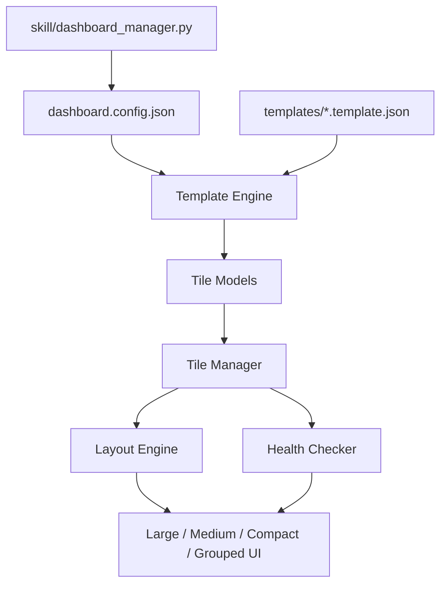

# OpenClaw Dashboard

OpenClaw Dashboard is a standalone, modular integration hub for OpenClaw environments.

It is designed for the real scaling problem:
- 3 integrations should feel rich and visual.
- 20+ integrations should still feel fast and navigable.
- New integrations should be added by templates, not code rewrites.

## Why This Exists

Most dashboards degrade as integrations grow. This project keeps one UI model that adapts by density:

1. `1-4` tiles: large cards with richer context
2. `5-9` tiles: medium cards for key metrics
3. `10-20` tiles: compact cards + right-side detail panel
4. `20+` tiles: category groups collapsed by default

## Core Principles

- Vanilla stack: Vite + vanilla JS + vanilla CSS
- Runtime templates: `templates/*.template.json` are loaded live
- 5s network budget: all fetches are timeout bounded
- LAN-first operation: no CDN dependency
- Operator-friendly control: CLI management for tile instances

## OpenClaw Style Architecture



## Quick Start

```bash
npm install
npm run dev
```

App URL: `http://localhost:5173`

Production build:

```bash
npm run build
npm run preview
```

## Runtime API Endpoints

Served by Vite middleware at dev time:

- `GET /api/templates`
- `GET /api/templates/_schema.json`
- `GET /api/templates/<file>`
- `GET /api/config/dashboard.config.json`
- `GET /api/proxy?target=<encoded-url>` for cross-origin integration checks

## Template Workflow

1. Drop a `*.template.json` into `templates/`
2. Wait for auto-discovery polling (15s) or click `Refresh`
3. Tile appears automatically with template defaults
4. Optionally persist a named instance in `config/dashboard.config.json`

Minimal template shape:

```json
{
  "template_id": "service-id",
  "template_version": "1.0",
  "display_name": "Service Name",
  "description": "What this integration does",
  "category": "ops",
  "icon": "🧩",
  "config_schema": {},
  "health_check": {},
  "metrics": [],
  "actions": []
}
```

Full contract rules are defined in [`templates/_schema.json`](templates/_schema.json).

## Built-In Starter Integrations

- ComfyUI
- Mailcow
- OpenClaw Gateway
- Delivery Hub
- Voice Pipeline

## CLI: Dashboard Manager

Use the OpenClaw skill CLI helper to manage durable tile instances:

```bash
python3 skill/dashboard_manager.py list
python3 skill/dashboard_manager.py add --template comfyui --id comfyui-lab --name "ComfyUI Lab" --set host=localhost --set port=8188
python3 skill/dashboard_manager.py remove --id comfyui-lab
python3 skill/dashboard_manager.py status
python3 skill/dashboard_manager.py refresh --sync-missing
```

## Repository Layout

- `src/core/` runtime orchestration (config/template/health/layout/tile manager)
- `src/components/` tile and panel UI renderers
- `src/utils/` fetch timeout wrapper and jq-lite evaluator
- `src/styles/` design system and responsive layout styling
- `templates/` runtime-discovered integration templates
- `config/` active tile instance config
- `skill/` OpenClaw skill docs and CLI manager

## Security and Ops Notes

- Do not place secrets in template or config JSON files.
- Restrict proxy target hosts before internet-facing deployment.
- Default examples use local/mock endpoints for safe bootstrapping.

## Contributing

1. Fork and create a feature branch.
2. Keep templates runtime-driven; avoid hardcoding integration logic in UI code.
3. Run `npm run build` before opening a PR.
4. Include template/config examples for new integrations.

## License

This repository is licensed under the MIT License. See [`LICENSE`](LICENSE).
